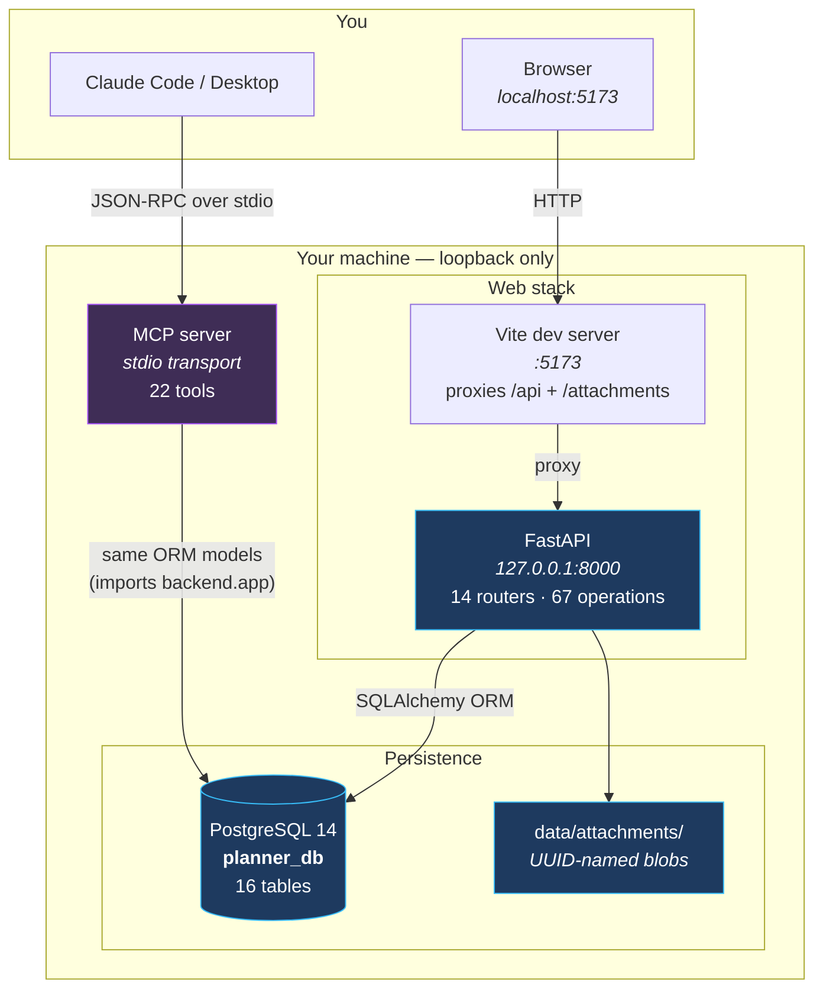
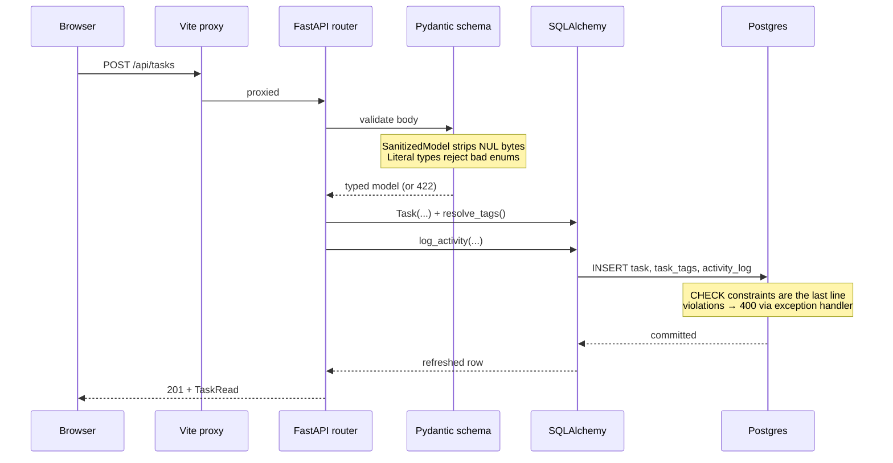
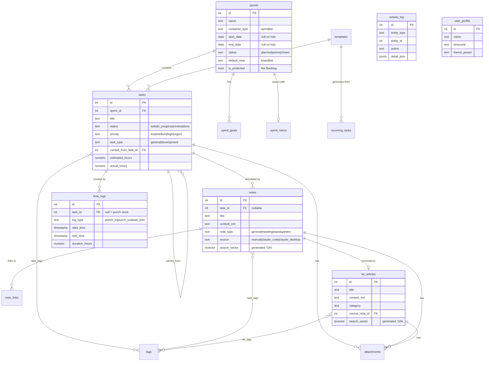
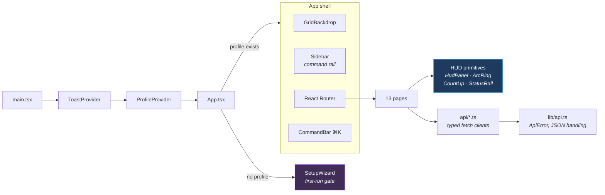
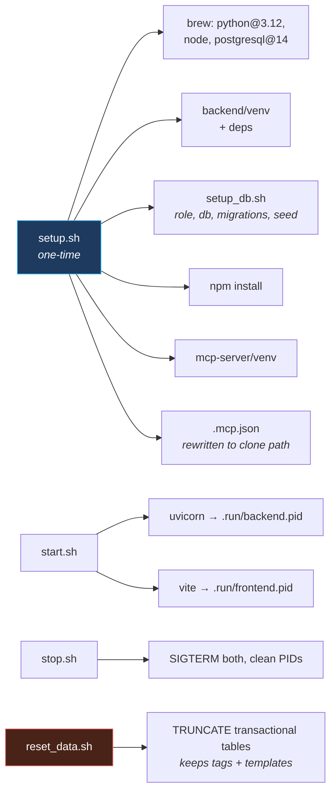
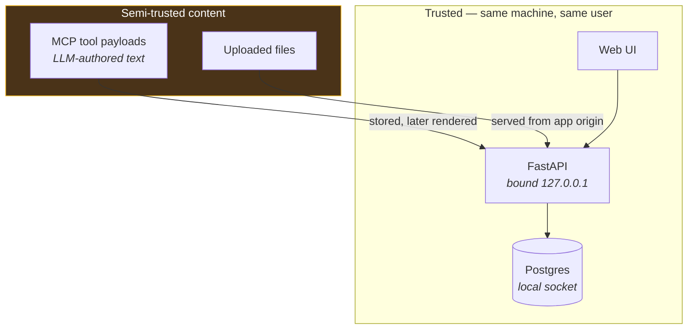

# Architecture

Personal Command Center — a local-first, single-user productivity system. Everything runs on
one machine: no cloud services, no accounts, no network exposure beyond loopback.

---

## 1. System overview

Two independent front-ends read and write the **same** Postgres database. The web UI talks to
it over HTTP; Claude talks to it over stdio through an MCP server that imports the backend's
own SQLAlchemy models — so both paths share identical schema, constraints, and business rules.

**Why the MCP server imports the backend rather than calling its HTTP API:** it removes a whole
class of drift. There is exactly one definition of what a task is, one set of CHECK constraints,
one activity-logging helper. The trade-off is that the MCP server needs the backend package on
its import path — handled by `mcp-server/app_instance.py`.

---

## 2. Request flow

The same write travels a different first mile depending on the entry point, but converges on
one ORM layer and one audit trail.

---

## 3. Data model

16 tables. Sprints own tasks; notes and KB articles float free but can attach to tasks;
everything can be tagged; every mutation lands in `activity_log`.

### Task containers

The `sprints` table is really a *task container* with a type. Both flavours hold tasks
identically; they differ only in how much ceremony they carry.

| | `list` | `sprint` |
|---|---|---|
| Dates | none | required |
| Close & carry-over | never | yes |
| Retro, goals, velocity | hidden | yes |
| How many active | any number | exactly one |

One container is flagged `is_protected` — the **Backlog**. It cannot be deleted, and task
creation falls back to it whenever no sprint is running. That combination is what makes the
`tasks.sprint_id` FK safely `NOT NULL`: there are no orphan tasks and no null-handling spread
through queries, yet capturing a task never requires setting up a sprint first.

Kanban isn't a third mode — the board *is* kanban. Board-vs-checklist is a per-container
`default_view` preference, orthogonal to container type.

### Design decisions worth naming

| Decision | Rationale |
|---|---|
| `search_vector` as a **generated** column + GIN index | Search index can never drift from content — Postgres recomputes it on every write, no trigger to forget. |
| Attachments are **polymorphic with a CHECK** | Exactly one of `task_id`/`note_id`/`kb_article_id` must be set; the database enforces it rather than trusting callers. |
| `carried_from_task_id` self-reference | Sprint carry-over builds a chain you can walk back through generations, instead of mutating the original. |
| Container **type** rather than a global "planning mode" setting | People mix styles — real sprints for one workstream, a standing list for another. A per-container type lets both coexist; a global mode would force a choice and hide features you'd want. |
| Protected Backlog instead of a nullable `sprint_id` | Keeps the FK `NOT NULL` (no orphans, no null-handling everywhere) while still guaranteeing a task can always be captured. |
| Enums as `TEXT` + `CHECK`, not native enum types | Adding a value is a plain migration, not an `ALTER TYPE` dance. Mirrored in Pydantic `Literal`s so bad values fail at 422 before reaching the DB. |
| `activity_log` append-only, `detail_json` as JSONB | Uniform audit shape across every entity without a column per change type. |

---

## 4. Frontend structure

61 components. State is local-first with a light context layer — no Redux, no server-state
library, because the data volume is small and every page reloads cheaply from a loopback API.

`ProfileProvider` gates the entire app: with no profile row, the setup wizard is the only thing
that renders. The stored `theme_preset` is applied as CSS custom properties
(`--accent-from/via/to`) on `<html>`, so the whole HUD — panels, glows, charts, progress
arcs — recolours from one source without a re-render.

---

## 5. Runtime & operations

Postgres runs independently as a `brew services` daemon — the start/stop scripts deliberately
don't manage it, so the database outlives app restarts.

---

## 6. Trust boundaries

There is **no authentication** — that is a deliberate choice for a single-user tool bound to
loopback, and the security posture depends on it staying that way. The real threat model is
*content*, not network peers: text that arrives through the API (including LLM-generated text
via MCP) and files that get uploaded, both of which are later rendered in a browser. Both
paths are hardened — see [`docs/QA_REPORT.md`](QA_REPORT.md).

**If this were ever exposed beyond localhost**, it would need, at minimum: authentication,
per-user data scoping, CSRF protection on state-changing routes, and rate limiting. None of
that exists today.
